# Unreal Engine Multiplayer: Authority and Replication Explained Simply

**Hello, fellow programmers!**
My name is Aida Drogan. I’m the co-founder and lead developer at the small game studio **SilverCord-VR**, and in this article I’ll try to explain Unreal Engine’s multiplayer architecture in the simplest words possible (with real-life examples and plenty of diagrams).

---

**Network architecture…**
Despite several years of working with UE and a solid portfolio of projects, I hadn’t touched network replication until recently (to be honest, I was avoiding it). There’s not much clear info, the official docs feel vague, and although everything is supposed to “just work out of the box”, what Epic actually put in that box is far from obvious.

So when a client came to us with a game prototype and asked to deploy it for several hundred players on a server, of course we accepted. Because the only way to beat fear and procrastination is to get your hands dirty — and finally understand how network replication works in Unreal Engine.

---

I’ll leave the link to my **Replication Graph template for 100+ players** here — https://github.com/droganaida/Replication_Graph_UE5.
*(spoiler: the default replication system doesn’t cut it for this scale)*.
But if your game is meant for a cozy group of friends, then the engine’s standard tools are more than enough — you might not even need to open the code editor at all.

---

## First step: Third Person Template

For testing, I recommend using the standard Third Person Template in Unreal Engine, which we’ll launch in network mode.

To launch the game in network mode, set **Net Mode → Play as Listen Server** and set the player count to at least 2.

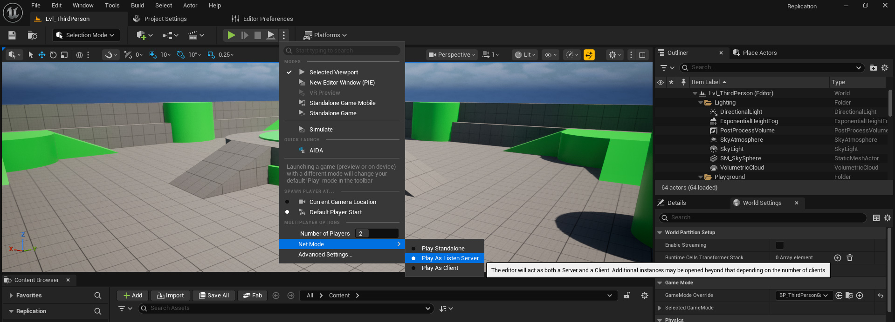

If everything goes well, the editor will open your game in multiple windows: one window is the Listen Server, the others are Clients.

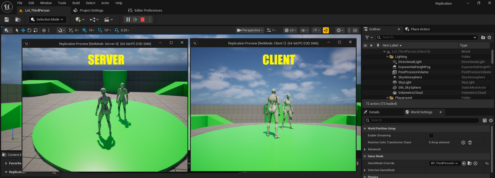

---

## What is a Listen Server and a Dedicated Server?

The first natural question: **what exactly is a Listen Server and what other server types exist?** And what’s the difference between what happens on the server and on the client?

Listen Server and Client are **Network Modes** in Unreal Engine. They define whether a running instance of the game has **Authority**, whether it has an active player character (Player Controller and Pawn), and whether other players can connect to this instance.

---

### All Unreal Engine Network Modes:

* **Standalone** — single player. This mode has one player who has full authority over the world and cannot accept connections from other players. Perfect for offline games with no networking.

* **Dedicated Server** — a headless server. It’s ready to accept clients and has full authority over the game world, but it doesn’t have an active player. This server runs in the background on a dedicated machine, renders nothing, and simply handles player connections and enforces game rules.
  You can’t just run a Dedicated Server build on your home PC to invite friends — it’s compiled from a special build of Unreal Engine and deployed to a proper server machine with solid hardware and a stable network.
  This is the server type used for large-scale multiplayer — including the poster child of Unreal Engine: **Fortnite**.
  Most indie devs probably won’t need a Dedicated Server (at least not early on).
  If you want to launch your game in this mode locally, you can enable **Launch Separate Server** in **Multiplayer Options** under **Editor Preferences** (in older UE versions, this option was called *Run Dedicated Server*).

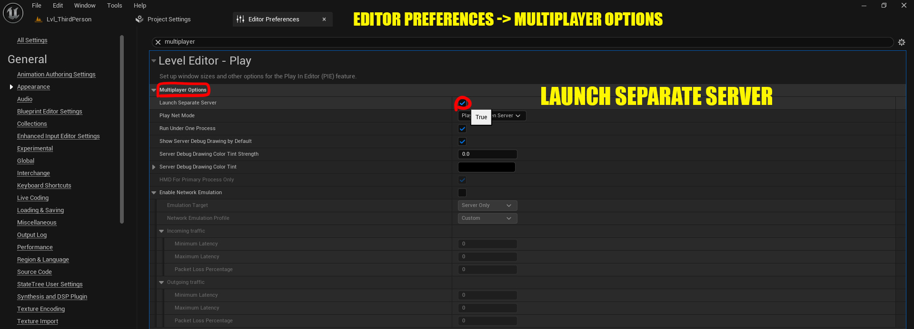

If you run the game this way, all windows (or more, depending on your player count) will be clients, and the server will run in the background.

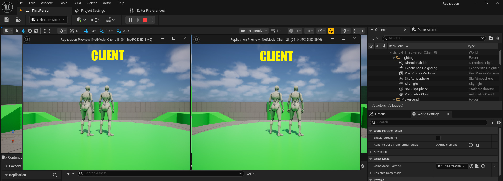

* **Listen Server** — the classic “host player”. It has an active player and full authority, and waits for other players to join. It’s exactly what happens when you host a co-op session for your friends. It’s the same game copy your friend runs when they join you — but yours has the power to manage the world and keep it consistent. If a client disconnects and later rejoins, their character’s progress, loot, cleared areas — all of it will be exactly as the host left it. *(Example: in Baldur’s Gate 3, if a client disconnects, the host takes control of their characters until they return).* All saves also belong to the host player who launched the server.

* **Client** — the guest player on the server. All the client truly “owns” is their character — although technically, the server runs it. The client just sends input and intent to the server. (More on this later.)

---

### Network Modes at a Glance

Here’s a quick comparison table for fellow diagram lovers (I love them too!):

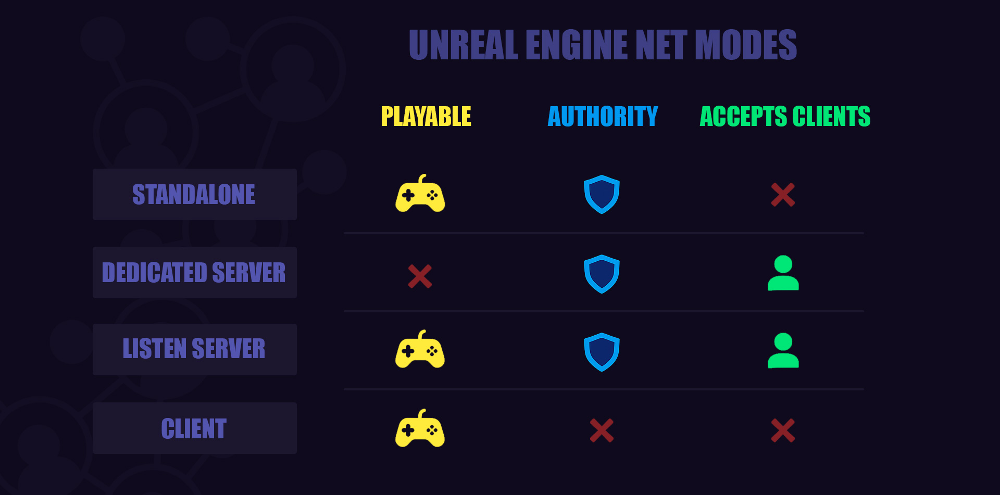

The client-server model is far more robust and scalable than peer-to-peer. All game state lives on the server — if players disconnect, the world stays intact. Plus, this model protects you from client-side cheating.

---

## Server Authority: Who’s the Boss?

Let’s dig into the heart of networked games.
We keep talking about **Authority** — server privileges that the client does *not* have. A simple example: you join your friend’s hosted session. If you previously cleared an area in your local game, you’ll see those enemies again — because now you’re in *their* version of the world.

---

### A D\&D Analogy

Step away from the computer: imagine a cozy, old-school Dungeons & Dragons session — a Dungeon Master, paper maps, plastic minis.
The DM is your server. Depending on the session, the DM might be a Listen Server (if they also run a player character and join the party) or a Dedicated Server (just running the world).

Players obey the DM. If the DM says *“Sure, roll again, you can sneak past the guard,”* the player’s action happens. If a player declares *“I summon 50 dragons to torch the final boss,”* the DM just smiles and says *“Roll for initiative — good luck with what’s in your inventory!”*

👉 **That’s Authority.** Only the server decides what’s allowed and what’s not.

---

### Who Moves the Pawn?

In Unreal Engine, your “figure” is an **APawn** — it does nothing by itself. Something has to control it. That “something” is the **Player Controller**.

In D\&D, it’s the DM moving your mini around the map based on your wishes. In-game, it’s the class that gets your keyboard, mouse or gamepad input. You press keys — your character moves — but the controller is in the server’s hands.

The animations and basic movement run on the client. More on that next.

---

### Replication, Proxies & Roles

When you join a networked game, your local controller disappears — you hand your figure to the DM. The client doesn’t “own” the controller, but gets a copy of it (replicated from the server).

Your Pawn’s movement — like everyone else’s — happens on the server and is replicated to clients through proxies:

* **Autonomous Proxy** — your own character’s movement.
* **Simulated Proxy** — other players’ characters.

So, every networked object has a **Role**:

* **Authority** — the final say on its state. Usually the server owns this for all replicated actors.
* **Autonomous Proxy** — a client-controlled object (e.g. your Pawn).
* **Simulated Proxy** — an object existing on the client, updated by the server (e.g. other players’ Pawns).

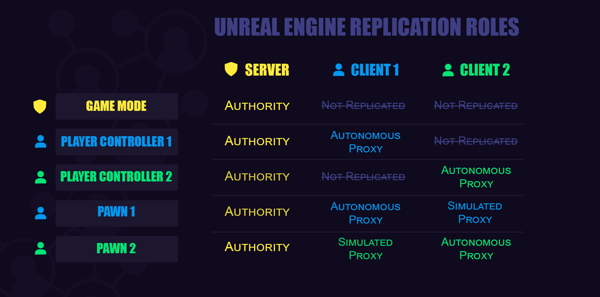

The same Actor can have different roles on server and clients — that’s the point.

---

### Authority Checks

Every event that affects a replicated object should run on the server.
Use `Is Server` and `Has Authority` to check that. Almost always, `Has Authority` means “server” — but not always! For example, a **Projectile** (bullet or missile) often spawns on the client. The client has authority for this specific object — to avoid any noticeable lag when firing. But the server still checks its trajectory.

✅ **Important:** If you do anything inside `Tick`, always check `Has Authority` first!

For Pawns, use `Is Locally Controlled` to check if this Pawn belongs to this player.

---

### How Pawn Movement Replicates

I promised we’d get back to this. How does movement replication actually work?

Character movement replication is fully built-in — you usually don’t have to touch it. The animation runs locally, but the server checks the position: is the Pawn really allowed to be here? That’s how cheating is prevented.

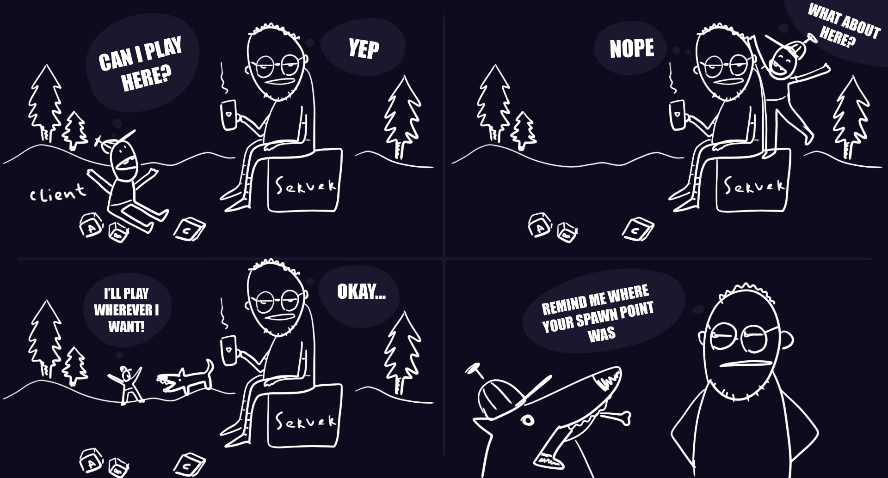

The server receives the client’s movement intent, approves or rejects it — so the player can’t phase through walls or teleport to Mars (unless your game allows it!). The client interpolates positions and plays animations smoothly.

---

## Replicating Actors & Components

Okay, we understand Pawns and Controllers. What about other Actors?

Can you spawn a new Actor so *everyone* sees it?
What happens if you just drop a new Cube into the world?

---

### Invisible Walls & Ghost Mountains

Spawn an Actor with a Static Mesh (Cube) in `Begin Play`, gated by `Is Server`.

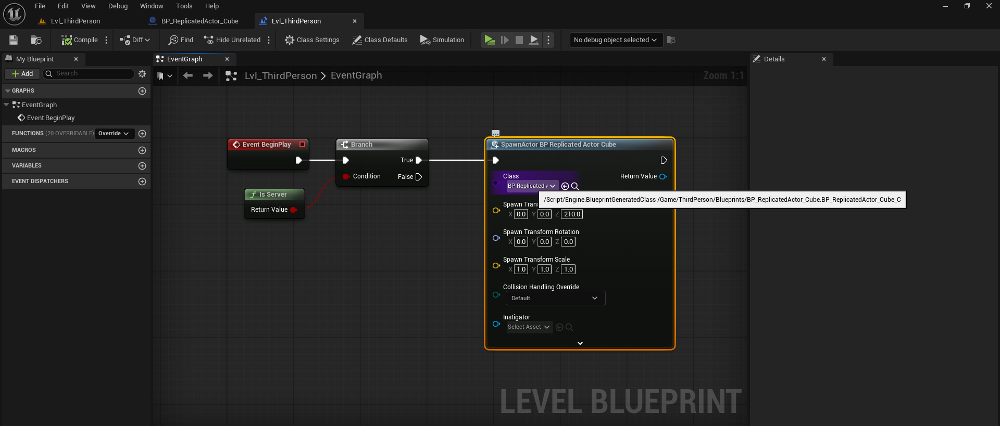

Result: the Cube appears in the server window only — clients don’t see it.

But what if a client’s Pawn tries to walk through that spot?
No visible Cube — but the Pawn bumps into an invisible wall.

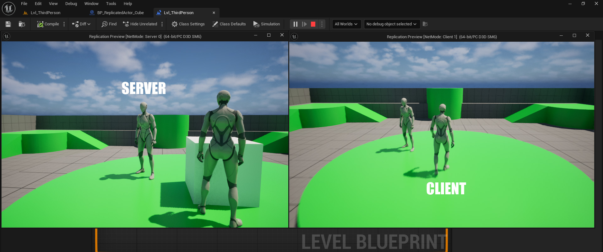

Now you get it: the server won’t let the client pass through — the rules are enforced on the server.
The DM built a mountain — just forgot to bring the mini! So the players hit an invisible obstacle.

What if the client spawns a Cube in the same spot?

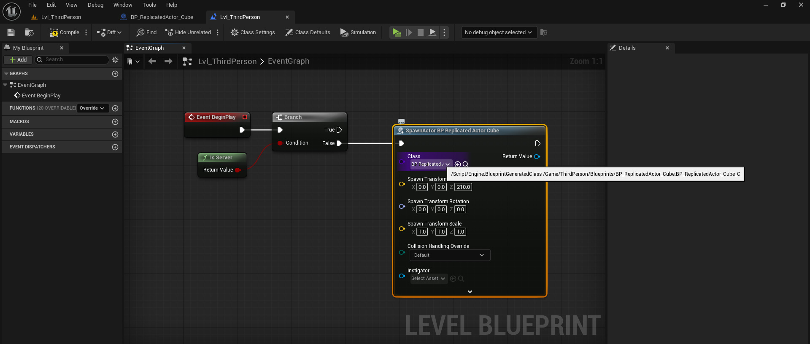

Now *everyone except the server* sees the Cube — but walking through it is easy. The server doesn’t know it exists, and the client can’t enforce world rules.

Just like a player dropping a coffee mug on the D\&D map and declaring it’s a volcano — the DM just shrugs and moves the minis properly (or punishes the player for being cheeky).

---

### The Right Way to Replicate Actors

So how do we fix this?

✅ **Use replication!**

Every Actor has replication settings:

* `Replicates` — the Actor exists on both server and clients.
* `Replicate Movement` — its position is synced for all clients (important for moving or physics objects).

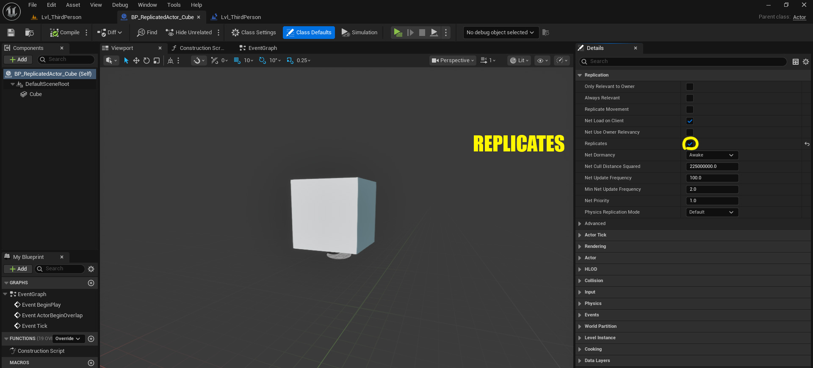

When you enable replication for your Cube, it’s visible and solid for everyone — just remember to keep the `Is Server` condition when spawning it.

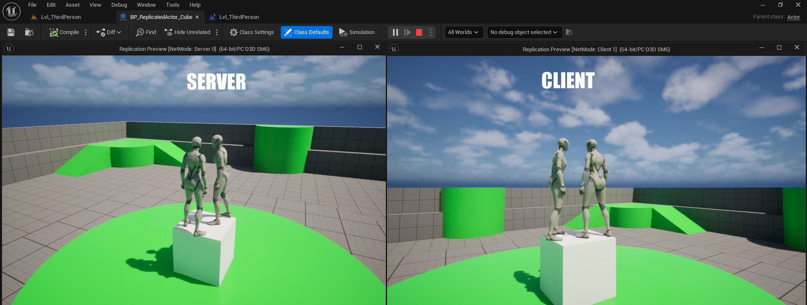

---

### Physics Components Must Replicate Too

What if the Actor has a physics component? Say, a soccer ball players can kick around together.

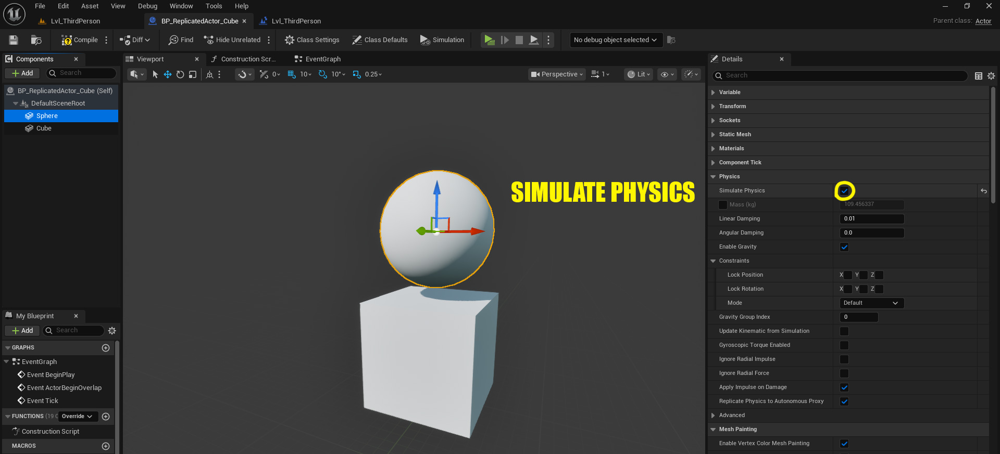

Run the game — the ball appears for everyone, but each client sees it rolling differently. The physics sim runs locally — so each player sees a different reality. Chaos!

The fix is simple: if an Actor has a physics component, it (and its parents) must have `Component Replicates` enabled.

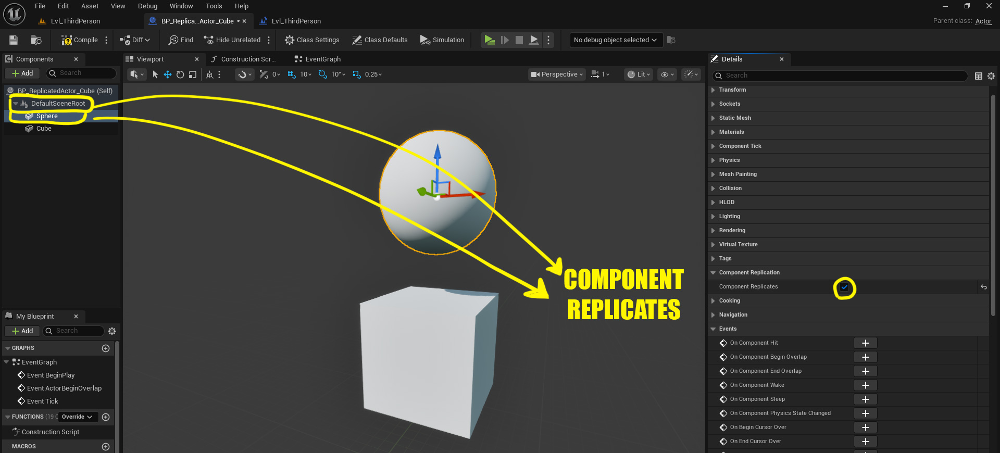

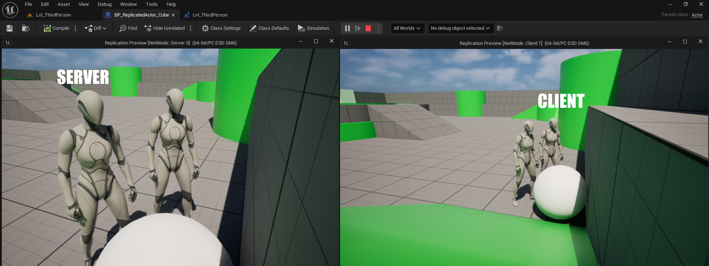

---

## Replicated Variables & RPCs

What if you want to add a health bar above your player’s head?
Usually, you’d do this with a **Widget Component** and two variables:
`MaxHP` (maximum health) and `CurrentHP` (current health).

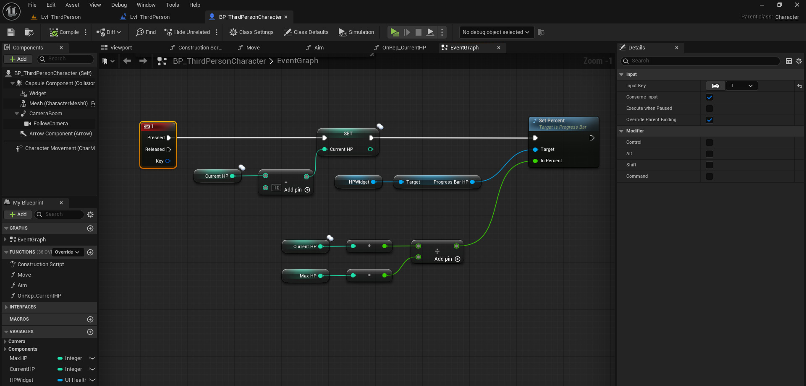

But in network mode, the player only sees changes to their *own* health bar.

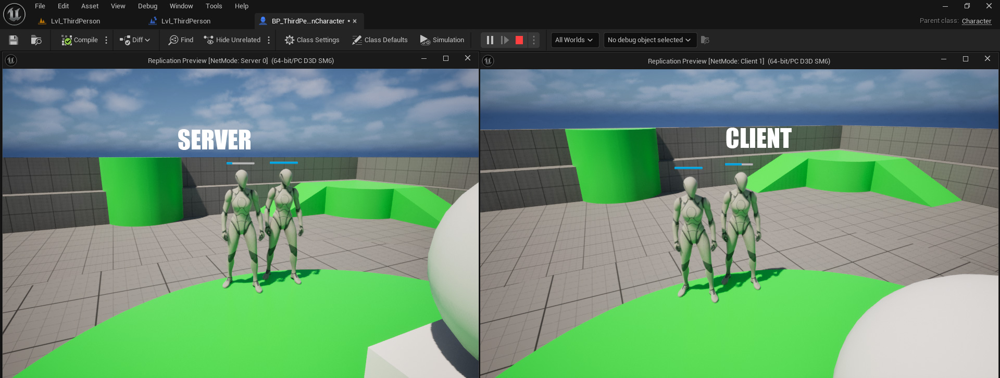

How do you make sure everyone sees it?

This is where **replicated variables** come in. Mark them as `replicated` so all players see the correct value.

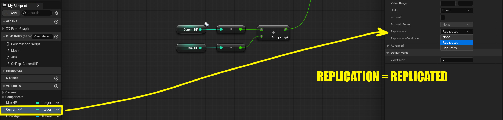

However, just making `CurrentHP` replicated and changing it on the client won’t work.
Why not? Because, remember: only the server is allowed to change the rules of the game. The client can’t just change its own health at will.

---

### Time to bring in the big guns: **RPCs (Remote Procedure Calls)**

RPCs let clients *ask* the server to do something — or let the server broadcast to all clients.

Unreal Engine has three main RPC types:

* **Run On Server** — the client sends a request to the server. Example: request to shoot or to change health.
* **Multicast** — runs on the server and sends an event to *all* clients. Example: play a muzzle flash or buff effect. These are expensive — use them sparingly!
* **Run On Owning Client** — the server calls an RPC for a *specific* client (the Pawn’s owner).

To change a player’s health, you’d use `Run On Server` — put your logic for modifying `CurrentHP` there.
Also: mark it `Reliable`.

---

### RPC Reliability: `Reliable` vs. `Unreliable`

RPCs can be `Reliable` or `Unreliable`.

* **Reliable** means the call *will* arrive. If it’s lost, Unreal keeps resending until it’s delivered.
* **Unreliable** means Unreal tries once — if it fails, too bad.

`Reliable` RPCs are queued until they succeed — but if the queue overflows, the client gets disconnected. So **never spam Reliable server RPCs!** For example, when handling gunfire, add a timer — don’t trigger an RPC on every frame.

What should be `Unreliable`? Cosmetic stuff like particle effects and sounds.
Character movement is `Unreliable` too — it syncs every frame, and flooding the Reliable buffer would break the server. UE’s movement system has its own buffer that drops old packets to avoid clogging the connection.

In the case of health changes: definitely make that `Reliable`.

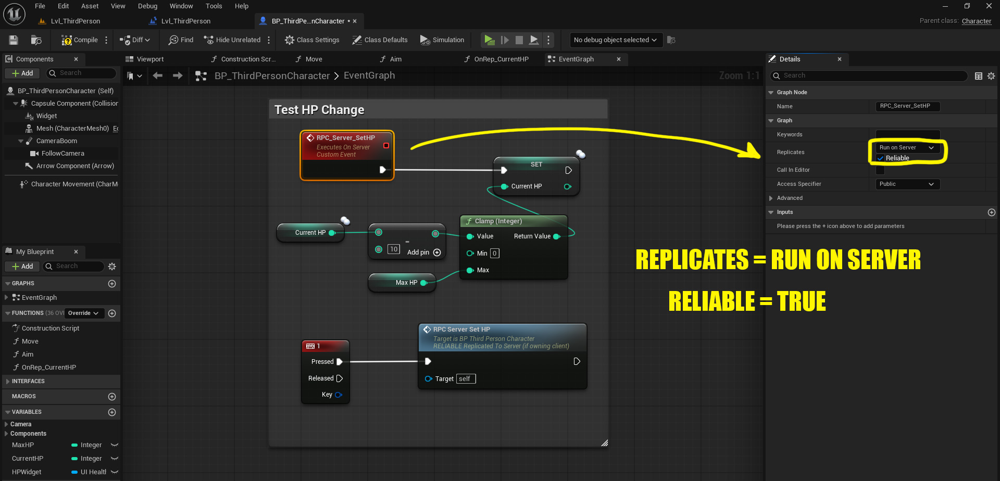

Even so, visually nothing happens yet — the health bar only updates for the local player.
But if you log `CurrentHP` in `Tick`, you’ll see each game instance knows the *real* HP for every player.

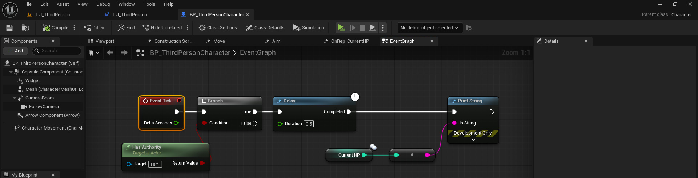
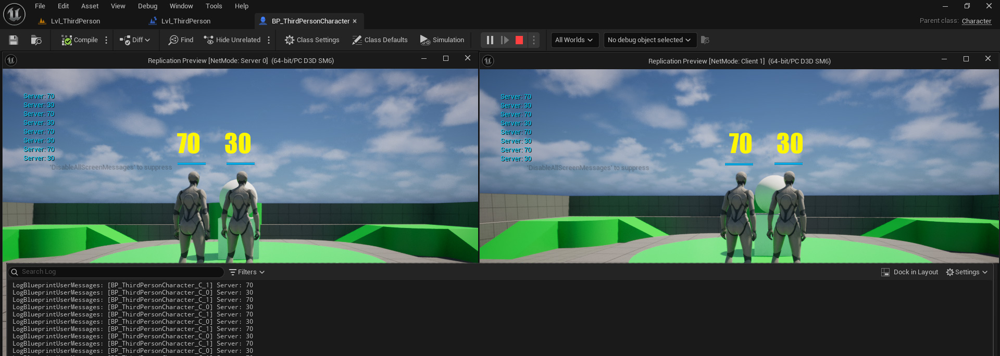

**Tip:** If you use `Tick`, always check `Has Authority` first!

---

### `OnRepNotify` & Event Dispatchers

The final step: actually update the health bar.
Logically, this should happen whenever `CurrentHP` changes.

You *could* bind the ProgressBar’s `Percent` to the variable directly in the Widget.

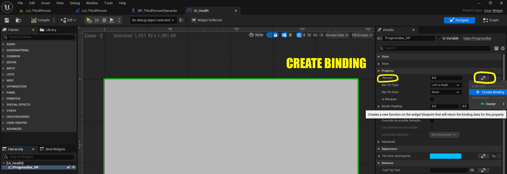

But it’s better practice to use **`RepNotify`**: mark `CurrentHP` with `RepNotify`, and Unreal will automatically generate a function that fires every time the variable changes.

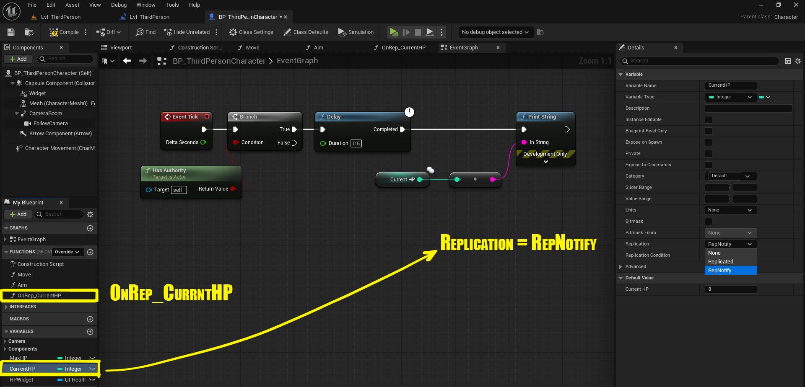

**Why is this better?**
It runs *only* on the clients — so you don’t waste server RPCs for UI.
Inside the `OnRepNotify` function, you can also fire an **Event Dispatcher** to handle the actual update.

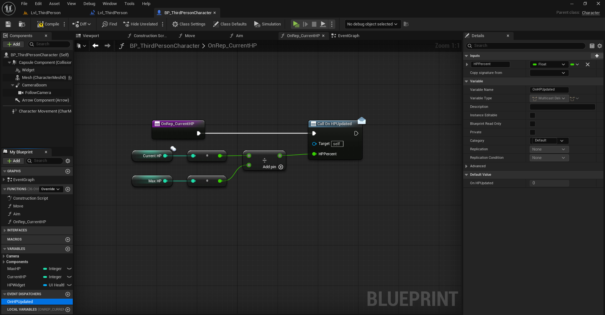

When you create the Widget, subscribe to the Dispatcher and write the logic to refresh the health bar.

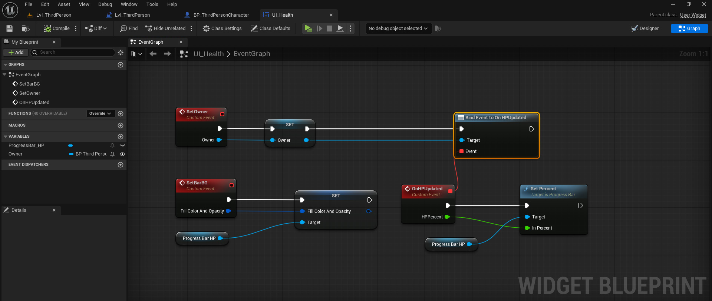

To make it clearer, you can recolor your own health bar using `Is Locally Controlled`.

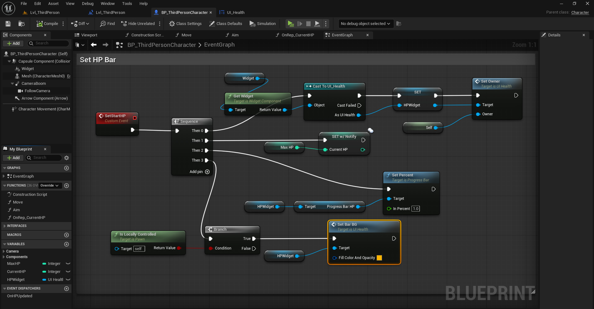

Now, when you run the game, all health bars update in sync — for every client and the server.

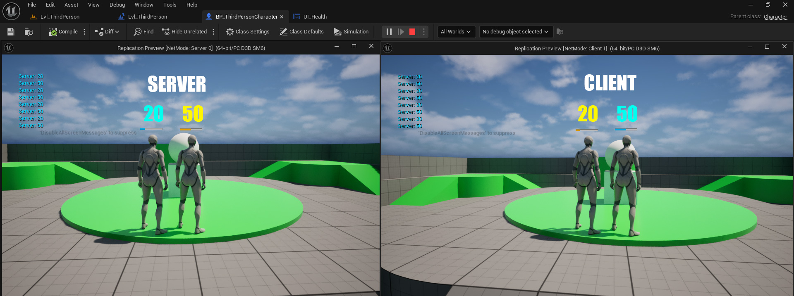

---

## How UE’s Core Classes Work in Multiplayer

Let’s wrap up with how the main Unreal Engine classes behave in a networked game — what replicates, what doesn’t, and how data flows between them.

* **GameMode** — defines game rules: who wins, what happens on death, how much XP you get, etc. Exists *only* on the server. It doesn’t replicate to clients. In a shooter, it counts kills and ends rounds. In a battle royale, it knows who’s the last player standing. To pass info to players, it uses **GameState**.
  (Think of it like the D\&D rulebook the DM checks.)

* **GameState** — the match’s current state: score, time left, who’s winning. Replicates to *all* clients. Only the server updates it.

* **PlayerState** — each player’s public info: name, score, team. Exists for each player. The server updates it and replicates it to relevant clients.
  (Like a sticky note on your mini with your name, level, class.)

* **PlayerController** — handles input from keyboard/mouse/gamepad. Controls the Pawn/Character on the map. Each player has one on both server and client — but only the server’s controller has authority. The client’s controller just forwards input.

* **Pawn** — your “body” in the world. Controlled by the controller. Replicates to everyone. Each Pawn has an **Owner** — its PlayerController.

* **Widget (UMG)** *(formerly HUD)* — draws the UI: crosshairs, score, indicators. Widgets live only on the client — they do *not* replicate. The server knows nothing about your UI.

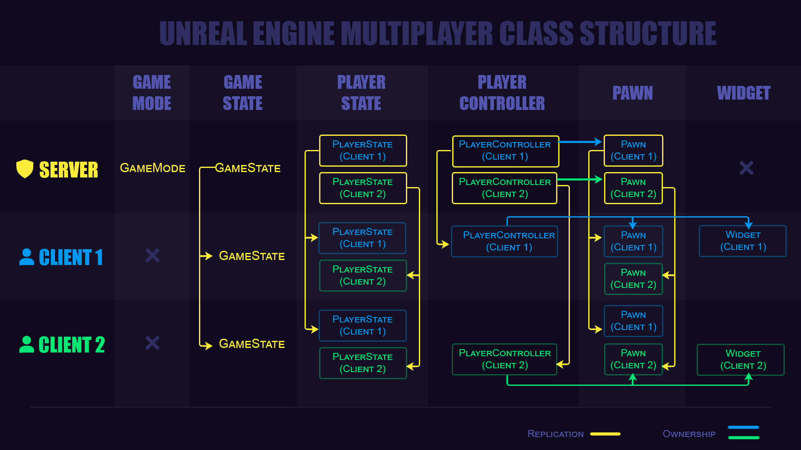

What else never replicates?
Animations, particles, sounds — most cosmetic effects run locally. For example, character movement replicates position, speed, jump status — but not the actual animation clip. The animation plays on your local machine.

---

## Final Thoughts

Good multiplayer architecture means keeping the server load light — replicate *only* what’s needed, but never lose vital info that makes the world look the same for everyone.

I hope my short walkthrough helps you grasp the basics of replication in Unreal Engine.
Thanks for reading — and may your servers stay stable and full!

---

This article was prepared by the team at [**SilverCord-VR**](https://www.silvercord-vr.com/) — we build games and VR projects with Unreal Engine and are always open to exciting collaborations.

