# Unreal Engine Multiplayer: сетевой мультиплеер, Authority и Replication простыми словами

**Привет, коллеги программисты!**
Меня зовут Аида Дроган, я сооснователь и главный разработчик небольшой игровой студии SilverCord-VR, и в этой статье я постараюсь рассказать о сетевой архитектуре мультиплеера в Unreal Engine максимально простым языком (конечно же с примерами из реальной жизни и картинками).

---

**Примечание:** в этом переводе многие термины, касающиеся Unreal Engine, я сознательно не переводила на русский язык, так как не работаю в русскоязычной версии движка (и даже не знаю, существует ли она) и не могу однозначно утверждать, что мой перевод терминов будет верный.

---

Сетевая архитектура... Несмотря на несколько лет работы с движком и солидный список проектов, созданных на базе Unreal Engine, до недавнего времени я её не касалась (и честно говоря боялась касаться). Информации мало, документация непонятная, вроде все должно работать «из коробки», но что положили разработчики в эту коробку совершенно непонятно.
Поэтому, когда к нам пришел клиент с прототипом игры и попросил разместить её на сервере для нескольких сотен игроков, мы конечно же взялись за эту задачу, потому что только так можно победить страх и лень и разобраться наконец с сетевой репликацией в Unreal Engine.

---

Ссылку на **темплейту для Replication Graph для серверов на 100+ человек** я оставлю здесь: https://github.com/droganaida/Replication_Graph_UE5.
*(Спойлер: репликация "из коробки" для этого кейса не годится)*.
Ну а если ваша игра ориетирована на небольшую теплую компанию игроков, тогда стандартных инструментов движка будет вполне достаточно, и даже открывать редактор кода не понадобится.

---

## Первый шаг: Third Person Template

Для тестов я предлагаю использовать стандартную Third Person Template в Unreal Engine, которую мы запустим в сетевом режиме.

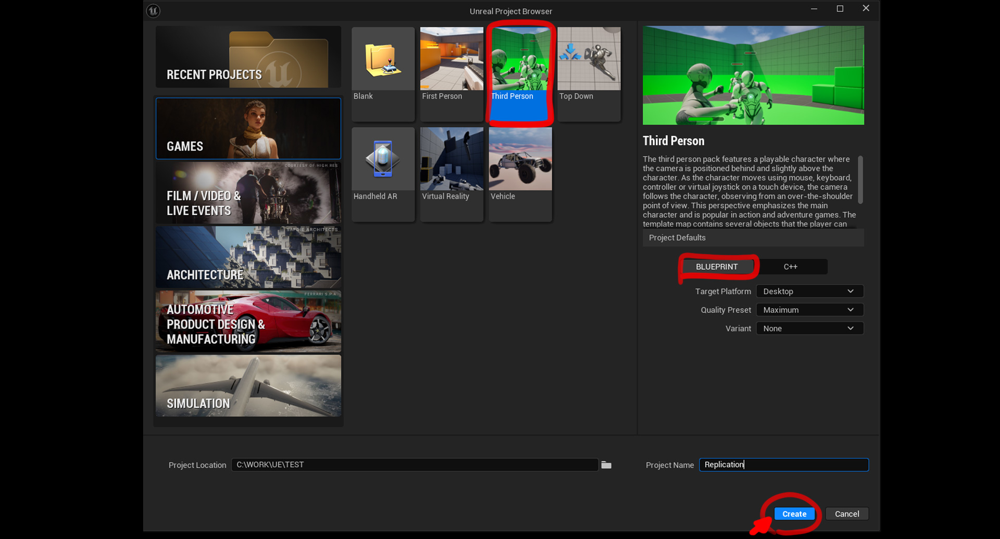

Чтобы запустить игру в сетевом режиме, нужно выбрать в редакторе Net Mode → Play as Listen Server и установить количество игроков не меньше 2.


Если всё прошло удачно, редактор откроет нашу игру в нескольких окнах: одно окно — это Listen Server, остальные — это Client.


---

## Что такое Listen Server и Dedicated Server

И первый закономерный вопрос: а **что такое Listen Server и какой ещё бывает сервер? И чем отличается происходящее на сервере и на клиенте?**

Listen Server и Client — это **Сетевые Режимы (Net Modes)** в Unreal Engine. Они отвечают за то, есть ли у запущенной копии игры полномочия (Authority), есть ли активный персонаж игрока (Player Controller и Pawn, управляемый им), и могут ли другие игроки присоединяться к этой копии игры.

---

### Все сетевые режимы Unreal Engine:
* **Standalone** — однопользовательский режим. В нём есть один игрок, который имеет все полномочия на изменение мира и не может подключать к себе других игроков. Подходит для игр, рассчитанных на одиночное прохождение без подключения к сети.

* **Dedicated Server** — выделенный сервер. Готов к подключению клиентов, имеет все полномочия на изменение игрового мира, но не имеет активного игрока. Такой сервер запускается в фоновом режиме на серверной машине, не отрисовывает никаких графических эффектов и служит только для того, чтобы объединять игроков и следить за исполнением правил игры.
Такое приложение нельзя запустить на обычном компьютере, чтобы пригласить друзей — оно собирается из особой версии Unreal Engine и отправляется на сервер с хорошим железом и интернет-каналом.
Именно такой тип сервера используется в серьёзных многопользовательских проектах, в том числе и в главной витрине движка Unreal Engine — Fortnite.
С огромной вероятностью именно этот тип сервера не понадобится простому инди-разработчику (по крайней мере, в начале карьеры).
Однако если вы хотите запустить свою игру в этом режиме, в редакторе можно включить галочку Launch Separate Server в разделе Multiplayer Options в Editor Preferences (в более старых версиях движка эта опция называлась Run Dedicated Server).

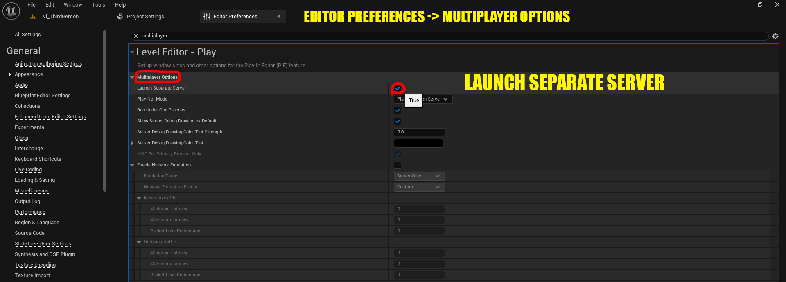

Если после этого запустить игру, то оба окна (или больше — согласно количеству игроков) будут клиентами, а сервер запустится в фоновом процессе.


* **Listen Server** — слушающий сервер или игрок-сервер. Имеет активного игрока, имеет все полномочия и ждёт подключений других игроков. Это тот самый сервер, который вы запускаете, когда приглашаете друга в любимую игру для совместного прохождения. Это такая же копия игры, как и у друга, присоединившегося по сети, но с правом управлять игровым миром и следить за его целостностью. Если клиент отключится, а затем подключится вновь, весь прогресс его персонажа, весь лут, зачищенные локации и всё остальное останется в том состоянии, в котором их оставил серверный игрок (например, в Baldur's Gate 3 при отключении клиента игрок-сервер получает его персонажей под контроль до повторного присоединения). И все сейвы игры будут у игрока, стартовавшего сервер.

* **Client** — это игрок-гость на сервере. Всё, что есть у клиента — это его персонаж, которым он управляет. Хотя и здесь всё не так просто: технически управляет им сервер, а клиент только сообщает свои намерения сделать что-либо в игре, но об этом позже.

---

### Сравнение сетевых режимов

Вот сравнительная таблица сетевых режимов для любителей красивых схем (да, я тоже их люблю):

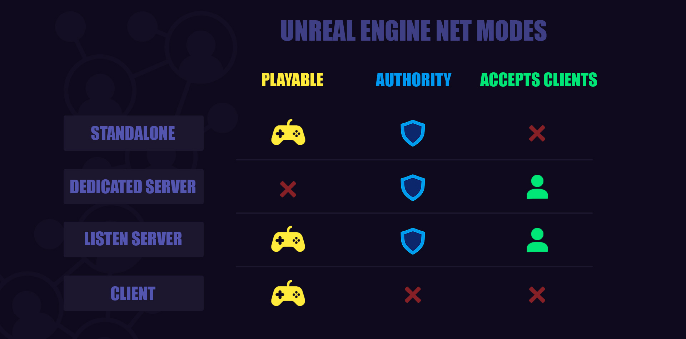

Модель клиент-сервер гораздо более надёжная и масштабируемая, чем peer-to-peer. Вся информация о текущей игре хранится на сервере, и отключение игроков не разрушает её. Кроме того, такая модель защищает от читинга со стороны игрока-клиента.

---

## Полномочия сервера и Authority

А теперь давайте разберемся в самой сути сетевой игры. Мы говорили о неких полномочиях сервера (Authority), которых нет у клиентов. Наглядный пример таких полномочий - это игра с другом, который приглашает вас присоединиться к своей игре. Если до этого вы играли локально в той же локации и зачистили всех врагов, то присоединившись к игре друга вы встретите их снова, потому что теперь вы стали гостем в чужой версии игры.

---

### D&D и Authority

Отойдем от компьютера и представим себе теплую ламповую игровую сессию в «Подземелья и Драконы» с настоящим Мастером Подземелья, картонными картами и пласиковыми фигурками.
Теперь Мастер Подземелья это сервер и в зависимости от стиля игры и договоренности с игроками, он может быть Listen Server (если создаст своего персонажа и присоединится к команде) или Dedicated Server (если будет просто управлять игровой сессией).

Игроки должны бесприкословно подчиняться Хозяину Подземелья, и если DM говорит «я разрешаю так сделать» (перебросить кубик, атаковать NPC или скрыться в ближайшем фонтане), то действие игрока защитывается, но если игрок заявляет, что он призвал 50 драконов, чтобы спалить финального босса, Мастер Подземелья усмехнётся и предложит кидать на инициативу (и сражаться тем, что найдешь в своем инвентаре).
**Это и есть Authority - право влиять на игровое окружение.** Только сервер решает, что позволено игрокам, а что нет.

---

### Кто управляет Pawn
А что с управлением персонажа? В Unreal Engine за «фигурку» отвечает класс APawn (это и есть фигурка игрока). Однако сам по себе Pawn ничего не делает. Фигурку должен кто-то двигать. И вот этот кто-то назвается **Player Controller**.
В «Подземельях и Драконах» это Мастер Подземелья, который перемещает фигурки на поле согласно пожеланиям игрока. В игре — это класс, который получает ввод с клавиатуры, мыши или геймпада. Игрок нажимает на клавиши, персонаж двигается, но контроллер в руках сервера.
Сами анимации и первичное движение происходят на клиенте, но об этом ниже.

---

### Репликация контроллера и Pawn, прокси и роли

В тот момент, как игрок присоединяется к сетевой игре, его личный контроллер исчезает, и он передаёт свою фигурку в руки Мастера Подземелья. Клиент не обладает контроллером, но получает его копию (происходит репликация с сервера).
Движение его персонажа, как и движение всех остальных игроков на сцене, происходит на сервере и реплицируется клиентам через прокси:

* **Autonomous Proxy** — движение собственного персонажа.
* **Simulated Proxy** — движение чужих персонажей.

Таким образом у сетевых объектов есть следующие роли (состояния в реплицируемой сети):

* **Authority** — имеет последнее слово о состоянии объекта и считается авторитетной версией. Эта роль обычно принадлежит серверу для всех реплицируемых объектов.
* **Autonomous Proxy** — объект, контролируемый клиентом. Например, Pawn, принадлежащий игроку.
* **Simulated Proxy** — это реплицированные объекты, которые существуют на клиенте, но не контролируются им напрямую. Они получают обновления от сервера о своём состоянии — например, персонажи других игроков.

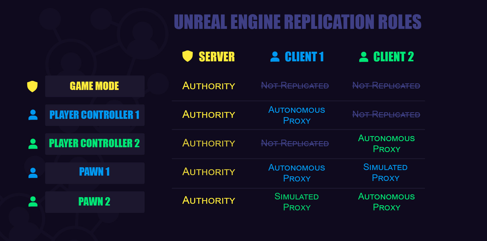

В Unreal Engine один и тот же объект может находиться в разных состояниях в зависимости от того, является ли запущенная копия игры сервером или клиентом. Это и есть его роль (Role).

---

### Проверки Authority

Все события, связанные с реплицируемым объектом, должны вызываться только на сервере — для этого существуют проверки ```Is Server``` и ```Has Authority```. В случае с Has Authority почти всегда это сервер, однако, например, Projectile (пуля или снаряд) в Unreal Engine спавнится на клиенте. У клиента есть Authority для этого типа объектов, так как даже минимальный лаг при стрельбе был бы заметен, если бы требовался запрос на сервер. Однако траектория пули всё равно проверяется сервером.

**Важно: если что-то описывается в Tick, не забывайте проверять Has Authority — и только в этом случае вызывйте логику в тике!**
Для Pawn также есть проверка ```Is Locally Controlled``` — она проверяет принадлежность персонажа данному игроку.

---

### Как работает репликация движения

Я обещала вернуться к движению Pawn и анимациям.
Как же происходит репликация для этого процесса?

Репликация движения персонажа готова из коробки, и как првавило вам не нужно ничего править. Сама анимация движения отрабатывается на клиенте, однако сервер корректирует данные о местоположении персонажа и проверяет, точно ли клиент может здесь находится (так мы избегаем читов).


Сервер получает данные о намерении клиента переместиться и подтверждает движение или отсекает попытки пройти сквозь стены, телепортироваться или улететь на Марс (если это запрещено правилами игры конечно же). Клиентская версия игры сама интерполирует движение между точками и запускает нужные анимации всех персонажей.

---

## Репликация объектов и компонентов

С контоллерами и пешками разобрались. А что с остальными объектами в игре?
Можно ли добавить на сцену нового актора так, чтобы его увидели все игроки?
Что будет, если просто добавить на нашу сцену новый куб например?

---

### Неосязаемые стены и невидимые горы

Заспавним Actor, в котором есть компонент Static Mesh (куб) по событию ```Begin Play``` и после проверки условия ```Is Server```.


Ожидаемо, что виден объект только в серверном окне, а клиенты просто его не видят.
Но что будет, если клиентский персонаж попробует пройти через то место, где на сервере находится куб? Куба нет, однако персонаж втыкается в невидимую стену.


Используя наши свежие знания о репликации движения персонажа, мы легко можем объяснить это поведение. Сервер не дает клиенту разрешение пройти сквозь куб, потому что только сервер устанавливает правила игры.
Мастер Подземелья построил гору на пути игроков (правда забыл принести фигурку, и гора есть только в вашем воображении). Но правило игры гласит: «Ты не пройдёшь!»

А что будет, если клиент поставит кубик в этом же месте?

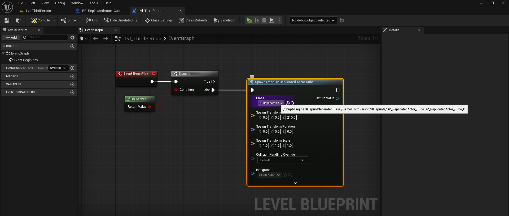

Теперь все, кроме сервера, увидят куб, однако пройти сквозь него не составит труда. Сервер ничего не знает об этом препятствии, а у клиента нет права изменять правила игры.

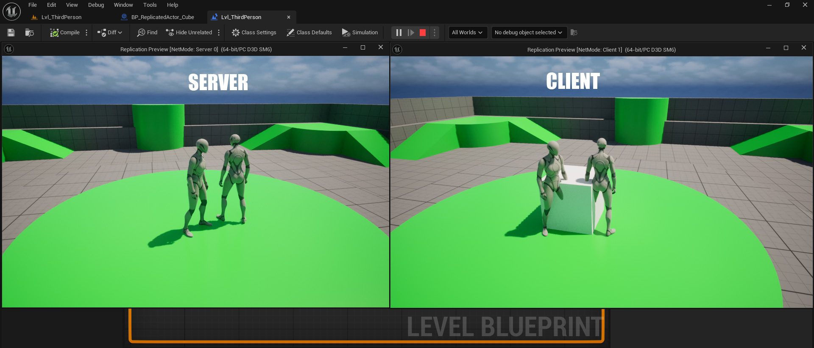

Игрок за столом может поставить на карту стаканчик с кофе и сказать, что это опасный вулкан — но Хозяин Игры просто переставит фигурки согласно своим правилам (а то и «дебафнет» игрока за такую наглость).

---

### Правильная репликация Actor

Как же правильно решить эту задачу?
**Использовать репликацию объекта!**

У каждого объекта есть настройки репликации:

* `Replicates` — объект существует и на сервере, и на клиенте.
* `Replicate Movement` — положение Actor в пространстве передаётся всем клиентам (для движущихся или физически симулируемых объектов).


Если установить репликацию для куба на сцене, всё начнёт работать синхронно: препятствие будет видно и «осязаемо» для всех игроков. И не забудьте вернуть условие ```Is Server``` для спавна этого актора.

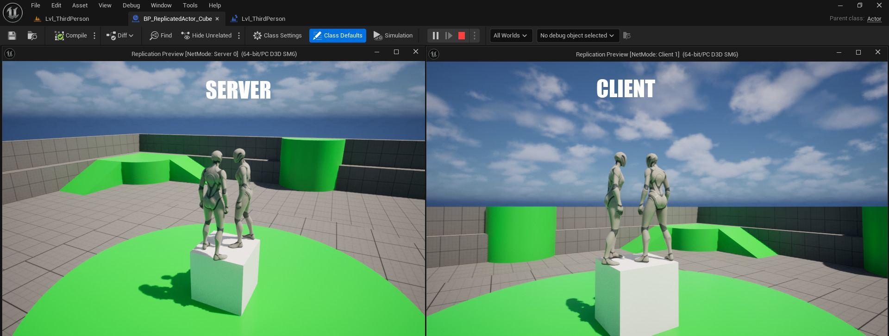

---

### Репликация компонентов с физикой

А что будет, если в нашего актора добавить компонент, симулирующий физику? Например, пусть будет мячик, который игроки теоретически могут вместе гонять по сцене.


Если сейчас запустить игру, то мячик будет виден всем игрокам, включая сервер, однако погонять его вместе игрокам не удастся. В каждом окне мячик ведет себя по-разному, потому что физика компонента рассчитывается для каждого локального игрока независимо друг от друга.
Даже при условии репликации самого актора, компонент с физикой будет катиться по-разному для каждого игрока, превращая ваш футбольный матч в чистое безумие.

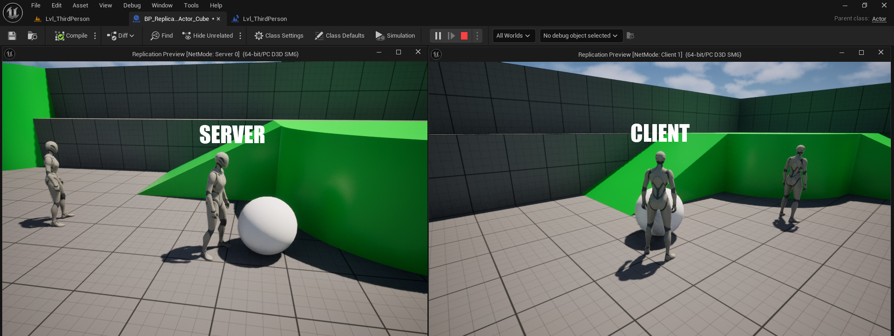

Решение этой задачи простое: если в акторе есть компонент, симулирующий физику, этот компонент и все его родители должны иметь свойство Component Replicates.


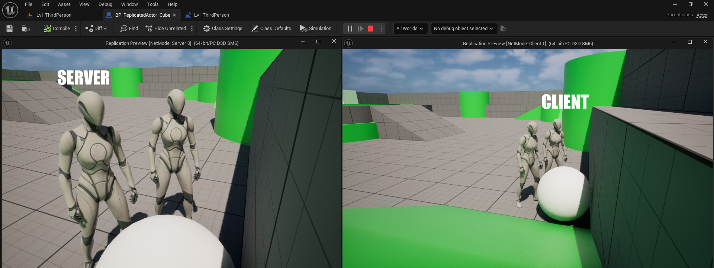

---

## Реплицируемые переменные и RPC

А что если мы хотим добавить полоску HP над головой игрока?
Обычно это делается через Widget-компонент и две переменные: ```MaxHP``` (максимально здоровье) и ```CurrentHP``` (текущее здоровье игрока).

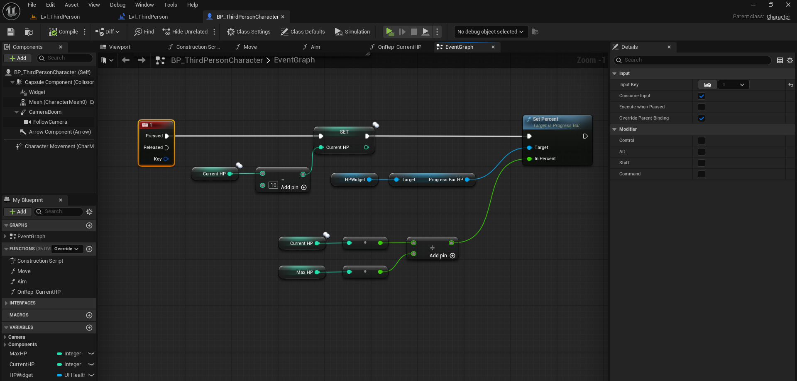

Однако в сетевом режиме игрок увидит изменения только на своей полоске HP.


Как сделать так, чтобы её видели все?
На помощь придут **реплицируемые переменные**. Их нужно объявить ```replicated```, чтобы все игроки видели корректные значения.

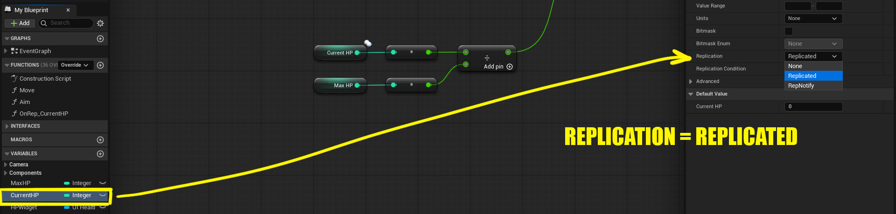

Однако, если просто сделать CurrentHP реплицируемой и изменить её на клиенте — результат не появится.
Почему?
Потому что, как мы помним, только сервер может изменять правила игры. Клиент никаким образом не сможет изменить свое здоровье без разрешения сервера. 

---

Придется обратиться к тяжелой артиллерии: **RPC — Remote Procedure Calls**. Эти функции позволяют клиентам запросить разрешение сервера на какие-то действия, а также позволяют серверу давать команды всем клиентам.

В Unreal Engine есть три основных типа RPC:

* **Run On Server** — клиент отправляет вызов на сервер. Например: запрос на выстрел или изменение здоровья.
* **Multicast** — вызывается на сервере и отсылает команду всем клиентам. Например: показать эффект выстрела или бафа. Эти вызовы дорогие — их стоит минимизировать.
* **Run On Owning Client** — сервер вызывает RPC только для конкретного клиента (владельца Pawn).

В случае с изменением очков здоровья игрока нам потребуется функция типа ```Run On Server```, именно в ней разместим логику изменения ```CurrentHP```.
Также установим флаг ```Reliable```.

---

### Надёжность RPC: Reliable и Unreliable

Для Remote Procedural Calls существует концепция надёжности. Reliable означает, что вызов гарантированно дойдёт. Данные будут посылаться другой стороне повторно до тех пор, пока не будут получены, если опция Reliable включена. В противном случае попытка пересылки данных одна и нас не волнует, будет ли реально обновлена переменная или вызвана функция.
Reliable функции будут складываться в буфер до их исполнения и если буфер будет переполнен, клиент будет отключен.
Поэтому **необходимо следить, чтобы серверные Reliable функции не вызывались слишком часто**. Например, для выстрелов — добавьте таймер, чтобы не триггерить событие каждый кадр.

Что может быть Unreliable? Косметические эффекты вроде частиц и звуков.
Также движение в Unreal Engine является Unreliable, так как синхронизация движения происходит каждый кадр и вероятность переполнения буфера Reliable переменных на сервере слишком высока. А при переполнения буфера клиент просто будет отключен от игры. Для движения есть собственный буфер, где старые записи стираются, чтобы не переполнить сеть.

В случае с обновлением переменной здоровья игрока, конечно выбираем ```Reliable```.

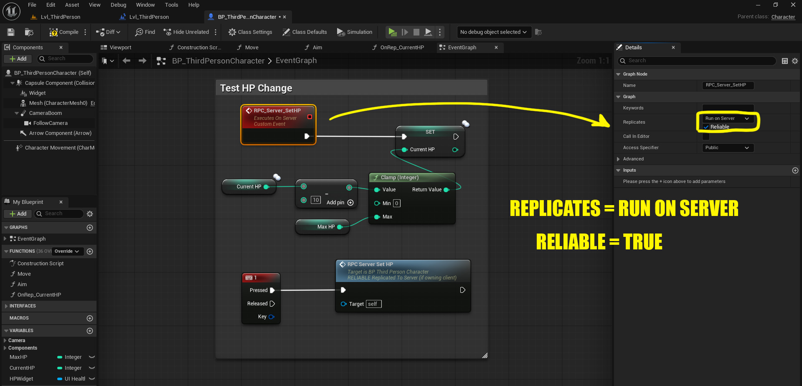

Но даже после этого визуально ничего не происходит. Полоска по-прежнему актуальна только для собственного персонажа игрока.
Однако, если добавить в Tick лог, который выводит значение переменной CurrentHP, мы увидим, что каждая копия игры знает актуальный показатель здоровья каждого игрока. 


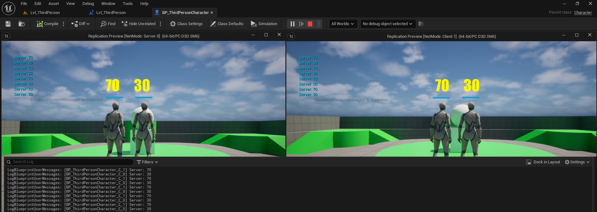

**Если что-то описываетe в Tick, не забывате проверять Has Authority и только в этом случае вызывайте логику в тике!**

### OnRepNotify и Event Dispatcher

Осталось изменить саму полоску. И логично предположить, что ее изменение должно происходить каждый раз, когда изменяется переменная CurrentHP.
Можно забиндить ее изменения в самом виджете на переменной Percent для ProgressBar.

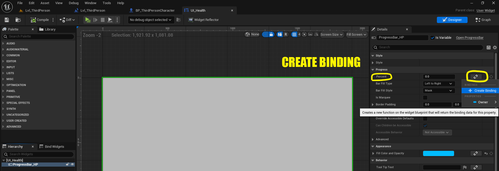

Но лучше использовать RepNotify: объявить переменную ```CurrentHP``` с ```RepNotify```, и Unreal автоматически создаст функцию, которая вызывается каждый раз при изменении переменной.

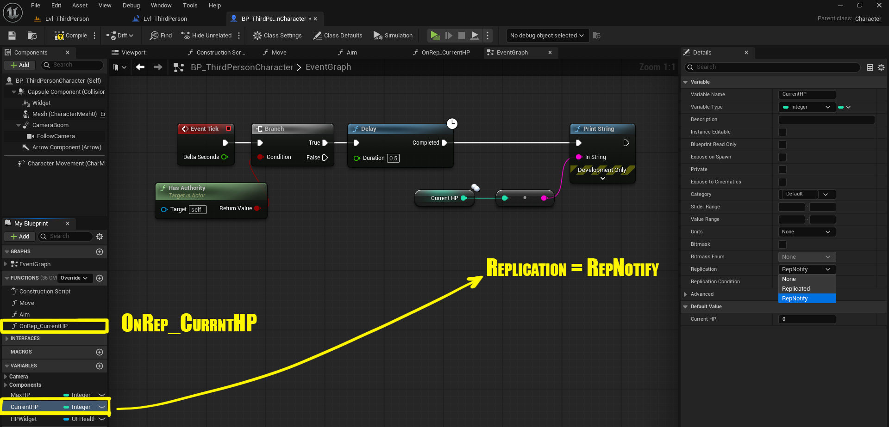

**Для производительности лучше использовать репликацию переменных и RepNotify функции, а не RPC**, так как это событие вызывается только на клиентах.
Можно повесить Event Dispatcher для изменения очков здоровья и вызывать его внутри OnRepNotify.

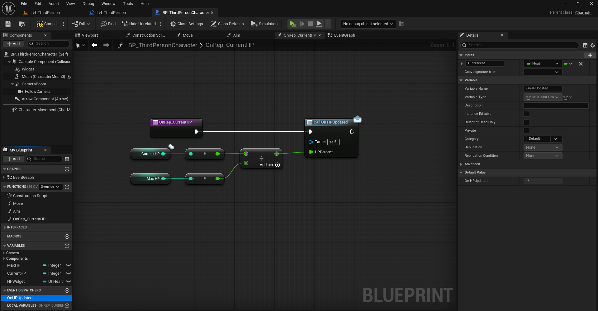

Теперь останется подписаться на Dispatcher при создании виджета и описать логику изменения полоски HP. 


Для наглядности перекрасим полоску своего персонажа в другой цвет, выполнив проверку ```Is Locally Controlled```.

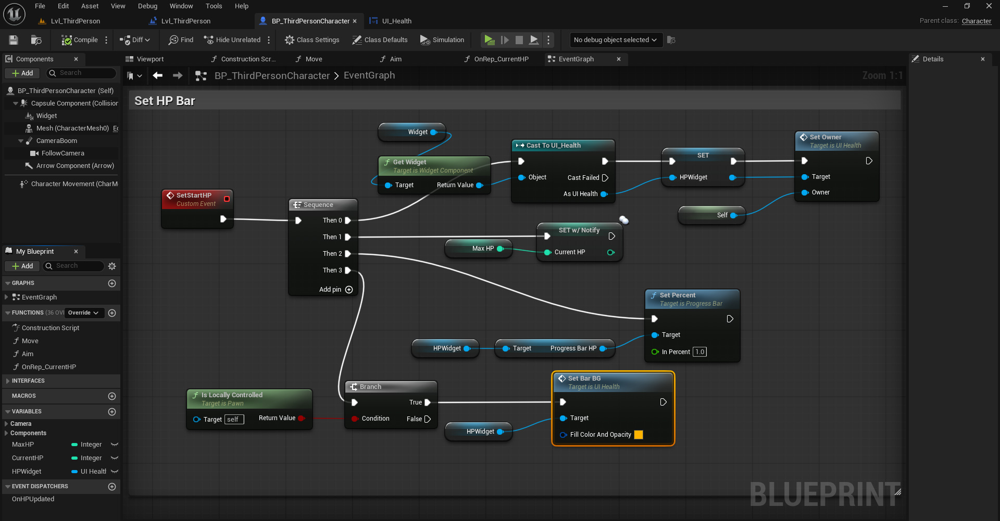

Теперь, если запустить приложение, все полоски HP будут изменяться синхронно у всех клиентов и на сервере.

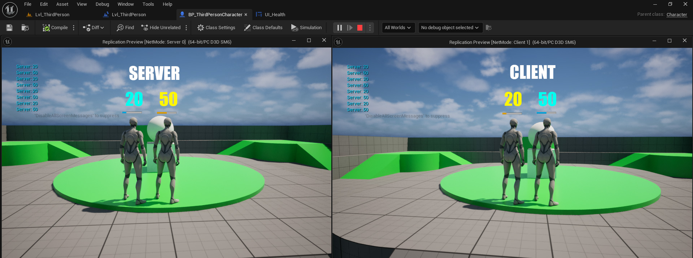

--- 

## Поведение основных классов Unreal Engine

Осталось понять, как ведут себя основные классы Unreal Engine в концепции сетевой игры. Что именно реплицируется, а что существует на сервере. И как данные передаются между ними.

* **GameMode** - отвечает за правила игры (когда и кому засчитывать победу, что делать в случае смерти игрока, сколько очков опыта получил игрок за свой квест и тому подобные вещи). Существует только на сервере, на клиенте его нет. В сетевом шутере именно этот класс считает фраги и решает, когда раунд окончен, а в battle royale определяет последнего выжившего и отдает ему победу. На клиент не реплицируется, однако общается с игроками через GameState, чтобы передать правила игры.
В случае с нашей ламповой сессией в Подземелья и Драконы это свод D-n-D правил, к которому обращается ведущий игры.

* **GameState** - текущая информация о матче, которая нужна всем игрокам. Хранит публичные данные: счет игры, оставшееся время, кто победил и так далее. Реплицируется всем клиентам. Только сервер может обновлять GameState, а все клиенты видят изменения.

* **PlayerState** - данные конкретного игрока: например никнейм, очки, команда. Создается для каждого игрока. Сервер обновляет PlayerState и реплицирует только тем клиентам, кому нужно видеть других игроков. PlayerState - это стикер, приклеенный к фигурке вашего героя, на которой Хозяин Подземелья может написать его уровень, имя и класс. Именно благодаря PlayerState игроки могут узнать информацию друг о друге.

* **PlayerController** - класс, который получает инпут с клавиатуры, мыши или геймпада. Управляет фигуркой игрока на сцене (Pawn или Character). Есть у каждого игрока на клиенте и на сервере. Однако авторитетный только серверный контроллер и именно сервер решает, может ли игрок находиться в том или ином месте на карте. Клиентский контроллер принимает ввод и отправляет серверу.

* **Pawn** - тело игрока, его фигурка на поле. Тот самый объект, которым управляет контроллер. Реплицируется всем. У каждого Pawn есть владелец (Owner) — PlayerController.

* **Widget (UMG)**, раньше HUD - класс для рисования интерфейса: прицел, счет, индикаторы. HUD живет только на клиенте и не реплицируется. Он существует только у локального игрока, а сервер ничего не знает про прицел или карту.

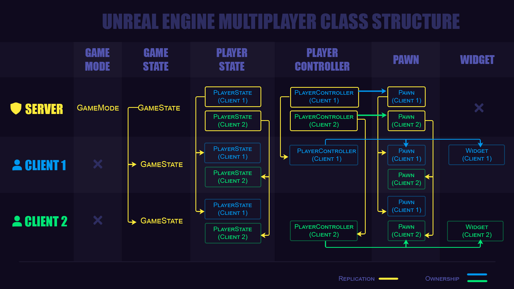

Что еще не реплицируется и существует только для локального игрока?
Анимации, частицы, звуки в большинстве случаев не реплицируются и вызываются на локальной машине. Например при движении персонажа реплицируется movement data, speed, jumping status, но не сама анимация. Анимацию воспроизводит локальная машина игрока.

--- 

## Заключение

Задача грамотной сетевой архитектуры — максимально разгрузить сервер и реплицировать только необходимые данные. При этом важно не потерять ключевую информацию, чтобы игра выглядела одинаково для всех.

Надеюсь, что мой краткий обзор помог вам разобраться с основами репликации в Unreal Engine.
Благодарю за внимание и желаю вашим серверам стабильного онлайна!

--- 

Эту статью подготовила команда [**SilverCord-VR**](https://www.silvercord-vr.com/) — мы создаём игровые и VR-проекты на Unreal Engine и всегда открыты к интересному сотрудничеству.